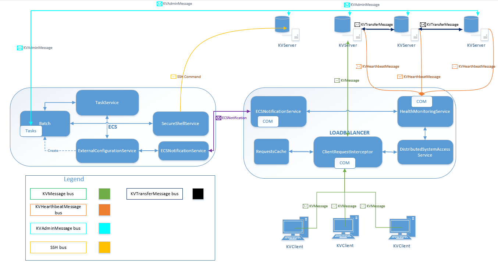

# Distributed Cloud DB 
> This cloud database project has been developped as part of the Cloud Database Praktikum (IN4163) at TUM (Technische Universität München). The team had to implement a distributed, scalable, encrypted, replicated database within a 16 weeks timespan and defend its design choices. The proposed solution includes an external configuration manager, SSL communication, a load balancer, custom transactions and StatsD metric. The team received an <strong>sehr gut</strong> grade for this project which is the highest possible.

### High Level Architecture
#### ECS/Loadbalancer and messaging
> 

#### How to contribute ?
- [X] Create a branch by feature and/or fix
- [X] Get the code
- [X] Commit and push
- [X] Update your branch
- [X] Create a pull request

#### Branch naming

##### Feature branch
> feature/ [Short feature description]

##### Bug branch
> fix/ [Short fix description]

#### Commits syntax:

##### Adding code:
> \+ Added [Short Description]

##### Deleting code:
> \- Deleted [Short Description]

##### Modifying code:
> \* Changed [Short Description]

##### Merging code:
> Y Merged [Short Description]
